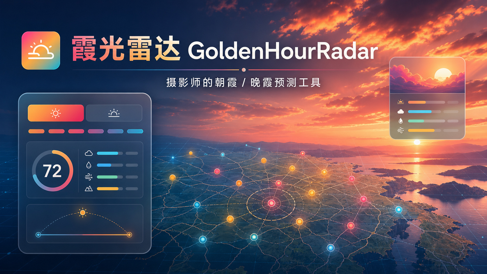
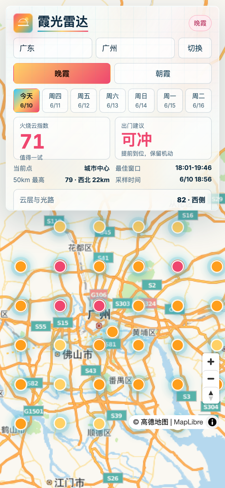

# 霞光雷达 GoldenHourRadar

**面向摄影爱好者的朝霞 / 晚霞预测工具。**  
**A lightweight sunrise and sunset cloud-color prediction tool for photographers.**



## 在线体验 Live Demo

[https://sunset-radar.pages.dev](https://sunset-radar.pages.dev)

霞光雷达是一个单文件网页应用，用免费天气 API、分层云量、降水、能见度和太阳方向光路采样，估算未来 7 天的朝霞 / 晚霞可拍摄概率。

GoldenHourRadar is a single-file web app that estimates sunrise and sunset cloud-color potential using free weather data, layered cloud cover, precipitation risk, visibility, and a simple sun-path sampling model.

> 这是一个面向摄影场景的开源实验项目，用于辅助判断日出 / 日落前后的云层与光线条件。  
> This is an open-source experimental project for photography planning, designed to help evaluate cloud and light conditions around sunrise and sunset.



## 功能 Features

- 未来 7 天朝霞 / 晚霞预测  
  7-day sunrise / sunset prediction
- 国内城市与旅游点选择  
  City and travel-destination selector
- 地图采样点交互  
  Interactive map sampling points
- 0-100 火烧云指数  
  Fire-cloud score from 0 to 100
- 降水、风速、能见度、湿度、本地天气判断  
  Local weather checks: precipitation, wind, visibility, humidity
- 按太阳方向采样云层质量  
  Sun-path cloud quality sampling
- 手机端磨砂玻璃 UI  
  Mobile-first frosted-glass UI
- 默认中文地图，也支持英文地图  
  Chinese map by default, English map via URL parameter
- 无需后端，直接本地运行  
  No backend required

## 快速开始 Quick Start

```bash
python3 -m http.server 4173
```

打开 / Open:

```text
http://localhost:4173
```

如果文件没有命名为 `index.html`，请打开：  
If your file is not named `index.html`, open:

```text
http://localhost:4173/index.html
```

## 地图语言 Map Language

中文地图 / Chinese map:

```text
http://localhost:4173
```

英文 / 国际地图 / English or international map:

```text
http://localhost:4173?map=en
```

地图由 MapLibre GL 渲染。中文底图使用高德瓦片，英文底图使用 OpenStreetMap 瓦片。

The map is rendered with MapLibre GL. The Chinese base map uses Gaode raster tiles; the English map uses OpenStreetMap raster tiles.

## 数据来源 Data Source

天气数据来自免费的 Open-Meteo Forecast API：  
Weather data comes from the free Open-Meteo Forecast API:

```text
https://api.open-meteo.com/v1/forecast
```

使用字段 / Used fields:

- `cloud_cover`
- `cloud_cover_low`
- `cloud_cover_mid`
- `cloud_cover_high`
- `relative_humidity_2m`
- `visibility`
- `precipitation`
- `wind_speed_10m`
- `daily.sunrise`
- `daily.sunset`

## 判断逻辑 How The Score Works

这个项目不会只看你头顶的云。

The score is not based only on the clouds above your head.

晚霞模式会看观察点西侧的云，朝霞模式会看观察点东侧的云。每个地图点都会综合：

For sunset, it samples clouds toward the west. For sunrise, it samples clouds toward the east. Each map point checks:

- 本地点天气：降水、低云、能见度、风速  
  Local weather: rain, low cloud, visibility, wind
- 太阳方向云层：35km、90km、160km 三段光路  
  Sun-path cloud layers: 35km, 90km, 160km
- 低云或降水是否阻挡光路  
  Whether low clouds or rain block the light path
- 中高云是否能成为被染色的画布  
  Whether mid/high clouds can become a colored canvas
- 湿度与通透度  
  Humidity and visibility

详细说明见 [docs/algorithm.md](docs/algorithm.md)。  
See [docs/algorithm.md](docs/algorithm.md) for details.

## 自定义 Customize

最常改的配置在 `index.html` 顶部附近：  
Most useful knobs are near the top of `index.html`:

```js
const CONFIG = {
  radiusKm: 50,
  stepKm: 15,
  mapProvider: new URLSearchParams(location.search).get("map") === "en" ? "en" : "zh",
  defaultCenter: [113.3245, 23.1065],
  defaultZoom: 8.35
};
```

常见修改 / Common changes:

- 修改 `regions`，换成你的城市列表  
  Change `regions` to your own city list
- 修改 `radiusKm`，调整机动范围  
  Change `radiusKm` for the search radius
- 修改 `stepKm`，调整采样密度  
  Change `stepKm` for sampling density
- 修改 `rayDistances` 和 `rayWeights`，调整光路模型  
  Change `rayDistances` and `rayWeights` for sun-path sampling
- 修改 `colorForScore`，调整地图点颜色  
  Adjust colors in `colorForScore`
- 翻译或改写 UI 文案  
  Translate or rewrite UI copy

## 二次开发 Development With An Agent

如果你想基于这个项目改出自己的城市版本，可以把仓库链接提供给豆包、DeepSeek、Cursor、Codex 或其他编程 Agent，然后使用 [PROMPT.md](PROMPT.md) 里的提示词作为开发说明。

To build your own city-specific version, provide this repository link to Doubao, DeepSeek, Cursor, Codex, or another coding agent, then use the prompt in [PROMPT.md](PROMPT.md) as the implementation brief.

## 项目名称 Project Name

- 中文名 / Chinese: **霞光雷达**
- 英文名 / English: **GoldenHourRadar**

## 许可证 License

MIT
